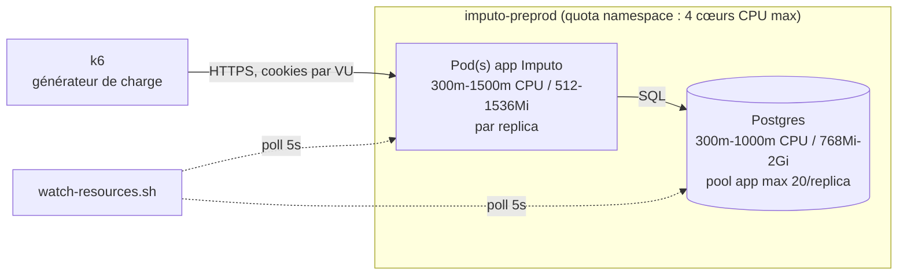
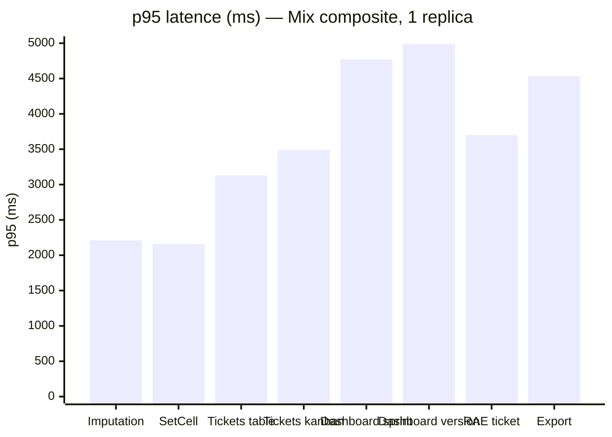
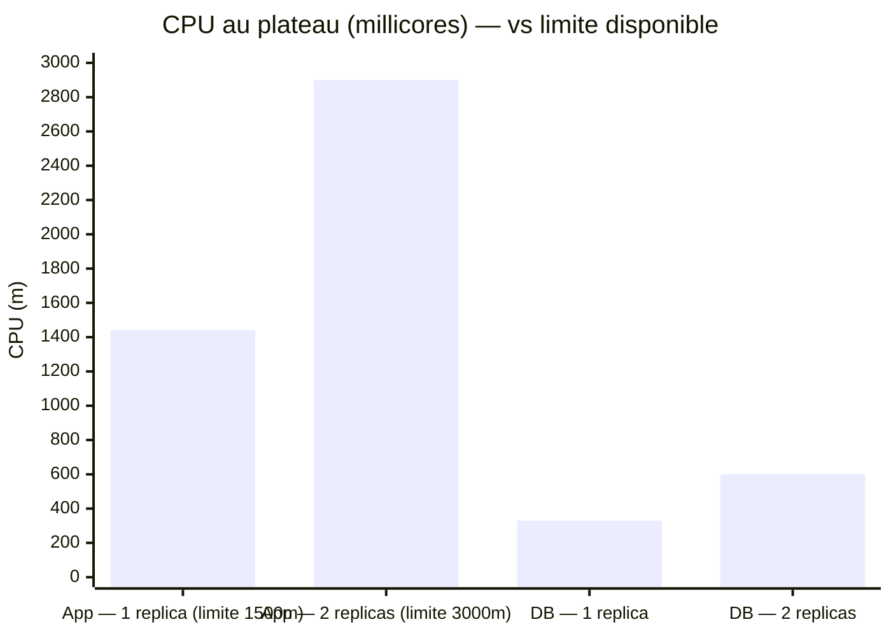

# AUDIT — Tests de charge (Imputo)

> État des lieux au 2026-08-13. Runs menés avec [k6](https://k6.io) contre `imputo-preprod`
> (scripts dans `loadtest/`, résultats bruts gitignorés dans `loadtest/results/`). Objectif :
> détecter les points de rupture avant qu'un usage réel ne les révèle, à l'échelle "plusieurs
> équipes, 50-150 utilisateurs concurrents" actée avec l'équipe. Ce document ne modifie rien au
> code, il sert de trace pour prioriser les optimisations.

## 1. Méthodologie et environnement

- **Outil** : k6, scripts dans `loadtest/k6/scenarios/` (voir `loadtest/README.md` pour l'usage).
- **Données** : seed étendu (`src/lib/server/db/seed.ts` + `getSeedScale()`), 5 espaces
  `QA Sandbox 1..5`, 25 comptes chacun, 2000 tickets chacun, 26 semaines d'historique — isolé du
  reste de la base (préfixe `QA Sandbox%` / domaine `@sandbox.test`), nettoyable via
  `npm run db:unseed`.
- **Environnement** : `imputo-preprod`, 1 seul pod app (300m-1500m CPU / 512-1536Mi RAM) et 1 seul
  Postgres (300m-1000m CPU / 768Mi-2Gi RAM, pool applicatif `max: 20` connexions par instance),
  sauf pour la comparaison de replicas (§5).
- **Suivi ressources** : `loadtest/scripts/watch-resources.sh`, poll toutes les 5s des connexions
  Postgres actives (`pg_stat_activity`) et du CPU/mémoire des pods (`oc adm top pod`).



## 2. Chronologie des runs (12-13/08, heure Paris)

```mermaid
gantt
    dateFormat HH:mm
    axisFormat %H:%M
    title Runs k6 contre imputo-preprod
    section Phase 1 — 1 replica
    Imputation (individuel + équipe) :done, p1, 15:50, 8m
    section Phase 2/3 — 1 replica
    Tickets (table + kanban)         :done, p2, 16:18, 8m
    Dashboard                        :done, p3, 16:26, 8m
    Export (1→5→10 concurrents)      :done, p4, 16:34, 6m
    Pages légères                    :done, p5, 16:40, 8m
    Mix composite                    :done, p6, 16:48, 8m
    section Comparaison replicas
    Mix composite — 2 replicas       :done, p7, 08:56, 8m
```



## 3. Phase 1 — Imputation seule (130 VUs, 1 replica)

La page la plus utilisée de l'app, isolée. **Tous les seuils passent, large marge partout.**

| Métrique | p95 | Seuil | Résultat |
|---|---|---|---|
| `GET /imputation` | 354ms | <800ms | ✅ |
| `GET /imputation?u=team` | 338ms | <800ms | ✅ |
| `setCell` (écriture) | 106ms | <400ms | ✅ |
| Erreurs HTTP | 0% | <1% | ✅ |

**Ressources au plateau** : CPU app 550-650m/1500m (~40%), CPU DB 130-165m/1000m (~15%), mémoire
négligeable des deux côtés, connexions Postgres actives plafonnées à 26.

→ **Conclusion phase 1** : à charge réaliste, la page la plus utilisée de l'app tient très
confortablement sur 1 replica.

## 4. Phase 2/3 — Tickets, Dashboard, Export, Pages légères, Mix composite (1 replica)

| Scénario | Métrique | p95 | Seuil | Résultat |
|---|---|---|---|---|
| Tickets — tableau | `tickets_table_duration` | **4.59s** | <800ms | ❌ ×5.7 |
| Tickets — kanban | `tickets_kanban_duration` | **5.12s** | (observation) | ⚠️ |
| Ticket — édition champ | `ticket_update_duration` | **1.68s** | <400ms | ❌ ×4.2 |
| Ticket — RAE par activité | `ticket_rae_duration` | **1.44s** | <400ms | ❌ ×3.6 |
| Dashboard — vue globale | `dashboard_overview_duration` | 190ms | <800ms | ✅ |
| Dashboard — sprint | `dashboard_sprint_duration` | 496ms | <800ms | ✅ |
| Dashboard — version | `dashboard_version_duration` | 565ms | <800ms | ✅ |
| Export (1→5→10 concurrents) | `export_duration` | 254ms → **2.8s** | (observation) | ⚠️ dégrade avec la concurrence |
| Pages légères (absences/mood/support/settings/admin) | `light_page_duration` | 281ms | <800ms | ✅ |

**0% d'erreurs HTTP dans tous les cas** — c'est un problème de latence, pas de panne.

### Mix composite (journée réaliste, ~130 VUs répartis 60% imputation / 20% tickets / 15% dashboard / 5% export)

Le plus révélateur : même des routes individuellement rapides (imputation, dashboard) **dégradent
fortement dès qu'elles tournent en même temps que les tickets**.

| Métrique | p95 (mix, 1 replica) |
|---|---|
| `GET /imputation` | 2.21s |
| `setCell` | 2.16s |
| Tickets — tableau | 3.13s |
| Tickets — kanban | 3.49s |
| Dashboard — sprint | 4.77s |
| Dashboard — version | 4.99s |
| RAE ticket | 3.70s |
| Export | 4.53s |



### Diagnostic (corrélé au CSV de ressources)

| | Tickets seul (1 replica) | Mix composite (1 replica) |
|---|---|---|
| CPU app (limite 1500m) | 1140-1275m (**76-85%**) | 1420-1444m (**95-96%**) |
| CPU DB (limite 1000m) | 392-550m (~45%) | 317-343m (~33%) |
| Connexions Postgres actives | 26 | 26 |

**La base de données n'est jamais le facteur limitant** (jamais plus de 55% de sa limite CPU dans
tous les runs de cette phase, connexions stables). Le plafond réel, c'est le **CPU du pod app,
seul replica** : dès qu'il approche 100%, toutes les requêtes se mettent à faire la queue derrière
le même processus — y compris celles qui, isolées, sont rapides (imputation).

Hypothèses techniques les plus probables (à confirmer par du profiling avant correction) :

1. **Vue kanban non paginée** (`listTicketsPage(..., paging: undefined)` → `pageSize: 1_000_000`,
   cf. `src/lib/server/services/tickets.ts`) : charge et enrichit tout le board à chaque requête.
2. **`enrichTickets()` recalcule le détail par activité (`activityBreakdown`) pour chaque ticket de
   la liste, y compris en vue tableau** (déjà paginée à 50) — potentiellement un coût significatif
   même quand le nombre de tickets renvoyés est petit, ce qui expliquerait que le tableau soit
   presque aussi lent que le kanban malgré la pagination.

## 5. Comparaison 1 vs 2 replicas (mix composite, mêmes paramètres)

Pour vérifier l'hypothèse "CPU app = goulot", le pod app a été temporairement scalé à 2 replicas
sur `imputo-preprod` (3 demandés, mais **bloqué à 2 par le quota CPU du namespace** — voir
encadré ci-dessous) et le même run mix composite rejoué à l'identique.

```mermaid
xychart-beta
    title "p95 latence (ms) — Mix composite, 1 vs 2 replicas"
    x-axis ["Imputation", "SetCell", "Tickets table", "Tickets kanban", "Dashboard sprint", "Dashboard version", "RAE ticket", "Export"]
    y-axis "p95 (ms)" 0 --> 5000
    bar [2210, 2160, 3130, 3490, 4770, 4990, 3700, 4530]
    bar [740, 529, 766, 1340, 1180, 1330, 595, 2290]
```


*(barre 1 = 1 replica, barre 2 = 2 replicas)*

| Métrique (p95) | 1 replica | 2 replicas | Gain |
|---|---|---|---|
| `GET /imputation` | 2.21s | 740ms | **-66%** |
| `setCell` | 2.16s | 529ms | **-75%** |
| Tickets — tableau | 3.13s | 766ms | **-76%** |
| Tickets — kanban | 3.49s | 1.34s | **-62%** |
| Dashboard — sprint | 4.77s | 1.18s | **-75%** |
| Dashboard — version | 4.99s | 1.33s | **-73%** |
| RAE ticket | 3.70s | 595ms | **-84%** |
| Export | 4.53s | 2.29s | **-49%** |

0% d'erreurs des deux côtés.

### Ressources — 1 vs 2 replicas



| | 1 replica | 2 replicas |
|---|---|---|
| CPU app (limite) | 1420-1444m / 1500m (**95-96%**) | 2800-2930m / **3000m** (**93-97%**) |
| CPU DB (limite 1000m) | 317-343m (~33%) | 566-620m (**57-62%**) |
| Connexions Postgres actives | 26 | **46** |

**Ce que ça confirme** : doubler le CPU app a quasi tout débloqué (gains de 49% à 84% de latence),
validant que le CPU app était bien le facteur limitant identifié en §4.

**Ce que ça révèle de nouveau** :

- **Le pool de connexions `max: 20` est bien par instance, pas partagé** — 2 replicas = jusqu'à 40
  connexions app + quelques-unes annexes (crons), cohérent avec les 46 observées. Chaque replica
  supplémentaire augmente donc aussi la pression sur les connexions Postgres, pas seulement sur le
  CPU app.
- **La DB commence à travailler nettement plus** (33% → 57-62% de sa limite CPU) dès que le
  goulot applicatif est levé — plus de requêtes passent, donc plus de charge réelle atteint la
  base. Pas critique aujourd'hui, mais **c'est la prochaine limite probable** si on ajoute encore
  des replicas sans revoir aussi le budget CPU de la DB.
- **Même à 2 replicas, le CPU app reste à 93-97% de sa nouvelle limite** au plateau — donc à cette
  charge (130 VUs, mix réaliste), on est encore proche de la saturation. Un 3ᵉ replica aiderait
  probablement encore, mais n'a pas pu être testé (voir ci-dessous).

> **Quota namespace atteint** : `core-resource-quota` sur `imputo-preprod` plafonne
> `limits.cpu` à **4 cœurs** au total. Avec la DB à 1000m + 2 replicas app à 1500m chacun, le quota
> est déjà à 4000m/4000m — **impossible d'ajouter un 3ᵉ replica sans augmenter ce quota**
> (changement de plateforme, à demander à un admin OpenShift). La preprod a été remise à 1 replica
> après le test (configuration normale).

## 6. Synthèse et pistes priorisées

| # | Piste | Effort | Impact attendu |
|---|---|---|---|
| 1 | Augmenter le quota CPU du namespace + passer l'app à 2-3 replicas (prod comme preprod) | Faible (config plateforme, pas de code) | Élevé — gain direct de 49 à 84% de latence mesuré, sans toucher au code |
| 2 | Charger le détail par activité (`activityBreakdown`) à la demande plutôt qu'eagerly pour chaque ticket de chaque liste | Moyen | Réduit le coût par requête, bénéficie à la fois au tableau et au kanban |
| 3 | Revoir la vue kanban non paginée | Moyen-élevé (contrainte UX : un kanban a besoin de voir toutes les colonnes, une pagination classique par page ne convient pas — plutôt limiter/virtualiser par colonne ou charger en lazy) | Réduit le pire cas (board complet à chaque requête) |
| 4 | Surveiller le CPU DB et le nombre de connexions actives si on ajoute des replicas au-delà de 2 | Faible (monitoring) | Anticipe la prochaine limite avant qu'elle ne devienne bloquante |

**Ordre recommandé** : commencer par (1), qui ne demande aucun changement de code et donne déjà le
plus gros gain mesuré ; (2) et (3) ensuite pour réduire le travail par requête et repousser encore
la limite ; (4) en continu dès qu'on touche au nombre de replicas.

## 7. Reproduire ces tests

Voir `loadtest/README.md` pour le détail des variables d'environnement et des scénarios
disponibles (`imputation.js`, `tickets.js`, `dashboard.js`, `export.js`, `mixed-day.js`,
`smoke-light-pages.js`). Résumé express :

```sh
# Seed à l'échelle (une fois) :
SEED_WORKSPACES=5 SEED_USERS_PER_WS=25 SEED_TICKETS_PER_WS=2000 SEED_WEEKS=26 npm run db:seed

# Rejouer le mix composite contre preprod :
BASE_URL="https://<route-preprod>" SEED_WORKSPACES=5 SEED_USERS_PER_WS=25 MIXED_VUS=130 \
  k6 run loadtest/k6/scenarios/mixed-day.js

# Nettoyer :
npm run db:unseed
```
