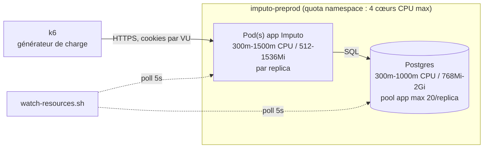
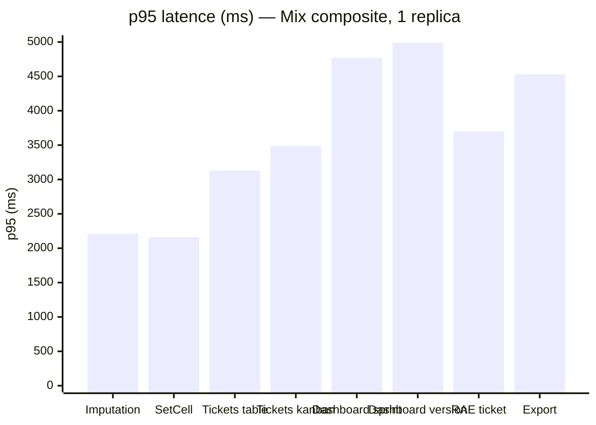
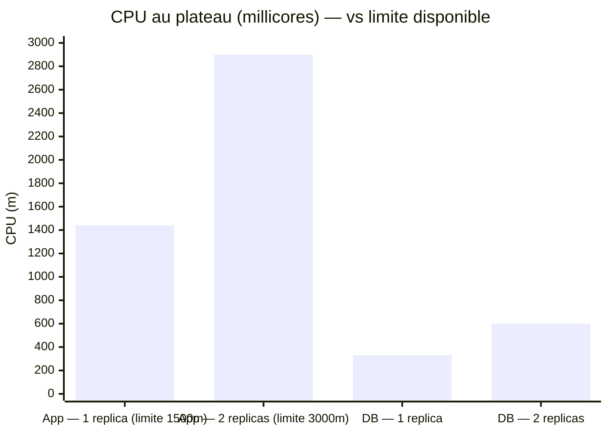

# AUDIT — Tests de charge (Imputo)

> État des lieux au 2026-08-13. Runs menés avec [k6](https://k6.io) contre `imputo-preprod`
> (scripts dans `loadtest/`, résultats bruts gitignorés dans `loadtest/results/`). Objectif :
> détecter les points de rupture avant qu'un usage réel ne les révèle, à l'échelle "plusieurs
> équipes, 50-150 utilisateurs concurrents" actée avec l'équipe. Ce document ne modifie rien au
> code, il sert de trace pour prioriser les optimisations.

## 1. Méthodologie et environnement

- **Outil** : k6, scripts dans `loadtest/k6/scenarios/` (voir `loadtest/README.md` pour l'usage).
- **Données** : seed étendu (`src/lib/server/db/seed.ts` + `getSeedScale()`), 5 espaces
  `QA Sandbox 1..5`, 25 comptes chacun, 2000 tickets chacun, 26 semaines d'historique — isolé du
  reste de la base (préfixe `QA Sandbox%` / domaine `@sandbox.test`), nettoyable via
  `npm run db:unseed`.
- **Environnement** : `imputo-preprod`, 1 seul pod app (300m-1500m CPU / 512-1536Mi RAM) et 1 seul
  Postgres (300m-1000m CPU / 768Mi-2Gi RAM, pool applicatif `max: 20` connexions par instance),
  sauf pour la comparaison de replicas (§5).
- **Suivi ressources** : `loadtest/scripts/watch-resources.sh`, poll toutes les 5s des connexions
  Postgres actives (`pg_stat_activity`) et du CPU/mémoire des pods (`oc adm top pod`).



## 2. Chronologie des runs (12-13/08, heure Paris)

```mermaid
gantt
    dateFormat HH:mm
    axisFormat %H:%M
    title Runs k6 contre imputo-preprod
    section Phase 1 — 1 replica
    Imputation (individuel + équipe) :done, p1, 15:50, 8m
    section Phase 2/3 — 1 replica
    Tickets (table + kanban)         :done, p2, 16:18, 8m
    Dashboard                        :done, p3, 16:26, 8m
    Export (1→5→10 concurrents)      :done, p4, 16:34, 6m
    Pages légères                    :done, p5, 16:40, 8m
    Mix composite                    :done, p6, 16:48, 8m
    section Comparaison replicas
    Mix composite — 2 replicas       :done, p7, 08:56, 8m
```



## 3. Phase 1 — Imputation seule (130 VUs, 1 replica)

La page la plus utilisée de l'app, isolée. **Tous les seuils passent, large marge partout.**

| Métrique | p95 | Seuil | Résultat |
|---|---|---|---|
| `GET /imputation` | 354ms | <800ms | ✅ |
| `GET /imputation?u=team` | 338ms | <800ms | ✅ |
| `setCell` (écriture) | 106ms | <400ms | ✅ |
| Erreurs HTTP | 0% | <1% | ✅ |

**Ressources au plateau** : CPU app 550-650m/1500m (~40%), CPU DB 130-165m/1000m (~15%), mémoire
négligeable des deux côtés, connexions Postgres actives plafonnées à 26.

→ **Conclusion phase 1** : à charge réaliste, la page la plus utilisée de l'app tient très
confortablement sur 1 replica.

## 4. Phase 2/3 — Tickets, Dashboard, Export, Pages légères, Mix composite (1 replica)

| Scénario | Métrique | p95 | Seuil | Résultat |
|---|---|---|---|---|
| Tickets — tableau | `tickets_table_duration` | **4.59s** | <800ms | ❌ ×5.7 |
| Tickets — kanban | `tickets_kanban_duration` | **5.12s** | (observation) | ⚠️ |
| Ticket — édition champ | `ticket_update_duration` | **1.68s** | <400ms | ❌ ×4.2 |
| Ticket — RAE par activité | `ticket_rae_duration` | **1.44s** | <400ms | ❌ ×3.6 |
| Dashboard — vue globale | `dashboard_overview_duration` | 190ms | <800ms | ✅ |
| Dashboard — sprint | `dashboard_sprint_duration` | 496ms | <800ms | ✅ |
| Dashboard — version | `dashboard_version_duration` | 565ms | <800ms | ✅ |
| Export (1→5→10 concurrents) | `export_duration` | 254ms → **2.8s** | (observation) | ⚠️ dégrade avec la concurrence |
| Pages légères (absences/mood/support/settings/admin) | `light_page_duration` | 281ms | <800ms | ✅ |

**0% d'erreurs HTTP dans tous les cas** — c'est un problème de latence, pas de panne.

### Mix composite (journée réaliste, ~130 VUs répartis 60% imputation / 20% tickets / 15% dashboard / 5% export)

Le plus révélateur : même des routes individuellement rapides (imputation, dashboard) **dégradent
fortement dès qu'elles tournent en même temps que les tickets**.

| Métrique | p95 (mix, 1 replica) |
|---|---|
| `GET /imputation` | 2.21s |
| `setCell` | 2.16s |
| Tickets — tableau | 3.13s |
| Tickets — kanban | 3.49s |
| Dashboard — sprint | 4.77s |
| Dashboard — version | 4.99s |
| RAE ticket | 3.70s |
| Export | 4.53s |



### Diagnostic (corrélé au CSV de ressources)

| | Tickets seul (1 replica) | Mix composite (1 replica) |
|---|---|---|
| CPU app (limite 1500m) | 1140-1275m (**76-85%**) | 1420-1444m (**95-96%**) |
| CPU DB (limite 1000m) | 392-550m (~45%) | 317-343m (~33%) |
| Connexions Postgres actives | 26 | 26 |

**La base de données n'est jamais le facteur limitant** (jamais plus de 55% de sa limite CPU dans
tous les runs de cette phase, connexions stables). Le plafond réel, c'est le **CPU du pod app,
seul replica** : dès qu'il approche 100%, toutes les requêtes se mettent à faire la queue derrière
le même processus — y compris celles qui, isolées, sont rapides (imputation).

Hypothèses techniques les plus probables (à confirmer par du profiling avant correction) :

1. **Vue kanban non paginée** (`listTicketsPage(..., paging: undefined)` → `pageSize: 1_000_000`,
   cf. `src/lib/server/services/tickets.ts`) : charge et enrichit tout le board à chaque requête.
2. **`enrichTickets()` recalcule le détail par activité (`activityBreakdown`) pour chaque ticket de
   la liste, y compris en vue tableau** (déjà paginée à 50) — potentiellement un coût significatif
   même quand le nombre de tickets renvoyés est petit, ce qui expliquerait que le tableau soit
   presque aussi lent que le kanban malgré la pagination.

## 5. Comparaison 1 vs 2 replicas (mix composite, mêmes paramètres)

Pour vérifier l'hypothèse "CPU app = goulot", le pod app a été temporairement scalé à 2 replicas
sur `imputo-preprod` (3 demandés, mais **bloqué à 2 par le quota CPU du namespace** — voir
encadré ci-dessous) et le même run mix composite rejoué à l'identique.

```mermaid
xychart-beta
    title "p95 latence (ms) — Mix composite, 1 vs 2 replicas"
    x-axis ["Imputation", "SetCell", "Tickets table", "Tickets kanban", "Dashboard sprint", "Dashboard version", "RAE ticket", "Export"]
    y-axis "p95 (ms)" 0 --> 5000
    bar [2210, 2160, 3130, 3490, 4770, 4990, 3700, 4530]
    bar [740, 529, 766, 1340, 1180, 1330, 595, 2290]
```


*(barre 1 = 1 replica, barre 2 = 2 replicas)*

| Métrique (p95) | 1 replica | 2 replicas | Gain |
|---|---|---|---|
| `GET /imputation` | 2.21s | 740ms | **-66%** |
| `setCell` | 2.16s | 529ms | **-75%** |
| Tickets — tableau | 3.13s | 766ms | **-76%** |
| Tickets — kanban | 3.49s | 1.34s | **-62%** |
| Dashboard — sprint | 4.77s | 1.18s | **-75%** |
| Dashboard — version | 4.99s | 1.33s | **-73%** |
| RAE ticket | 3.70s | 595ms | **-84%** |
| Export | 4.53s | 2.29s | **-49%** |

0% d'erreurs des deux côtés.

### Ressources — 1 vs 2 replicas



| | 1 replica | 2 replicas |
|---|---|---|
| CPU app (limite) | 1420-1444m / 1500m (**95-96%**) | 2800-2930m / **3000m** (**93-97%**) |
| CPU DB (limite 1000m) | 317-343m (~33%) | 566-620m (**57-62%**) |
| Connexions Postgres actives | 26 | **46** |

**Ce que ça confirme** : doubler le CPU app a quasi tout débloqué (gains de 49% à 84% de latence),
validant que le CPU app était bien le facteur limitant identifié en §4.

**Ce que ça révèle de nouveau** :

- **Le pool de connexions `max: 20` est bien par instance, pas partagé** — 2 replicas = jusqu'à 40
  connexions app + quelques-unes annexes (crons), cohérent avec les 46 observées. Chaque replica
  supplémentaire augmente donc aussi la pression sur les connexions Postgres, pas seulement sur le
  CPU app.
- **La DB commence à travailler nettement plus** (33% → 57-62% de sa limite CPU) dès que le
  goulot applicatif est levé — plus de requêtes passent, donc plus de charge réelle atteint la
  base. Pas critique aujourd'hui, mais **c'est la prochaine limite probable** si on ajoute encore
  des replicas sans revoir aussi le budget CPU de la DB.
- **Même à 2 replicas, le CPU app reste à 93-97% de sa nouvelle limite** au plateau — donc à cette
  charge (130 VUs, mix réaliste), on est encore proche de la saturation. Un 3ᵉ replica aiderait
  probablement encore, mais n'a pas pu être testé (voir ci-dessous).

> **Quota namespace atteint** : `core-resource-quota` sur `imputo-preprod` plafonne
> `limits.cpu` à **4 cœurs** au total. Avec la DB à 1000m + 2 replicas app à 1500m chacun, le quota
> est déjà à 4000m/4000m — **impossible d'ajouter un 3ᵉ replica sans augmenter ce quota**
> (changement de plateforme, à demander à un admin OpenShift). La preprod a été remise à 1 replica
> après le test (configuration normale).

## 6. Synthèse et pistes priorisées

| # | Piste | Effort | Impact attendu |
|---|---|---|---|
| 1 | Augmenter le quota CPU du namespace + passer l'app à 2-3 replicas (prod comme preprod) | Faible (config plateforme, pas de code) | **Élevé, confirmé** — gain direct de 49 à 84% de latence mesuré, sans toucher au code |
| 2 | ~~Charger le détail par activité (`activityBreakdown`) à la demande~~ | Fait | **Invalidé par la mesure** — voir §7, gain non mesurable |
| 3 | Alléger le payload kanban (id/clé/titre/état/avancement seulement) + charger le détail complet à la demande à l'ouverture de la modale | Moyen-élevé — **écarté pour l'instant**, cf. §8 (risque de casser la modale d'édition, partagée à l'identique avec la vue tableau, pour un gain plafonné par le vrai facteur limitant identifié) | Plafonné (le vrai goulot est la file d'attente mono-processus, cf. §8, pas le poids d'une requête) |
| 4 | Surveiller le CPU DB et le nombre de connexions actives si on ajoute des replicas au-delà de 2 | Faible (monitoring) | Anticipe la prochaine limite avant qu'elle ne devienne bloquante |

**Ordre recommandé** : (1) reste, et de loin, le levier le plus rentable — confirmé par la mesure
**et** par l'explication mécanique (file d'attente sur un processus Node mono-thread, cf. §8). (2)
a été tentée et invalidée (§7). (3) a été analysée et sciemment écartée (§8) : le gain plafonné ne
justifie pas le risque sur une modale partagée. Sans investissement plus lourd (profiling en
production, refonte du flux de données du composant tickets), **(1) est la seule piste avec un
rapport gain/risque clairement favorable à ce stade.**

## 7. Expérience menée — retirer le détail par activité pour kanban/recherche (résultat négatif)

**Hypothèse testée** : `enrichTickets()` calcule le détail par activité (`activityBreakdown` —
contributeurs + labels, 2 requêtes DB + agrégation JS) pour **chaque** ticket renvoyé, y compris en
vue kanban et dans la recherche de la palette de commandes, alors qu'aucune des deux ne l'affiche
jamais (seules les lignes fines de la vue tableau le font). L'hypothèse : ces 2 requêtes inutiles,
multipliées par les ~2000 tickets du kanban non paginé, expliquent une bonne part du CPU app
saturé observé en §4.

**Changement fait** (`src/lib/server/services/tickets.ts`, `enrichTickets` + `listTicketsPage`) :
paramètre `includeBreakdown` — à `false` pour le kanban et `/api/command/tickets`, les 2 requêtes
ne partent plus et `activityBreakdown` est renvoyé vide dans ces cas. Aucun changement visible :
ni l'un ni l'autre n'affichait cette donnée. 344 tests + `svelte-check` toujours au vert.

**Mesure** (`tickets.js` rejoué sur `imputo-preprod`, mêmes paramètres que la baseline du §4) :

| Métrique (p95) | Baseline (§4) | Après le changement | Écart |
|---|---|---|---|
| Tickets — tableau | 4.59s | 4.53s | négligeable |
| Tickets — kanban | 5.12s | 5.63s | négligeable (bruit de mesure) |
| RAE ticket | 1.44s | 1.53s | négligeable |
| Édition champ | 1.68s | 1.48s | négligeable |

CPU app toujours saturé pendant le plateau (jusqu'à 1760m observés sur une limite de 1500m — le
pod est en throttling constant). **Aucun gain mesurable.**

**Pourquoi ça n'a pas marché** : les tickets "top-up" générés en masse pour le test de charge
(`SEED_TICKETS_PER_WS`) n'ont **aucun historique d'imputation** (cf. `loadtest/README.md`) — donc
pour ~98% des 2000 tickets d'un espace, les requêtes retirées renvoyaient déjà un résultat quasi
vide. L'hypothèse ciblait un coût qui n'existait pas à cette échelle de données. Le vrai coût
CPU est ailleurs — plausiblement la requête de base (tri sur ~2000 lignes avec jointure), le calcul
JS répété par ticket, ou le rendu SSR / la sérialisation de la page (payload complet par ticket —
~20 champs — répété ~2000 fois pour le kanban, potentiellement le facteur dominant vu que la vue
tableau, elle, paginée à 50 lignes, est presque aussi lente : ça pointe vers un coût par requête
concurrente plutôt que vers le volume de données d'un seul ticket).

**Conclusion** : le changement est gardé (il reste correct et légèrement plus économe), mais
**ne pas répéter ce type de pari sans profiling** — la piste 3 du tableau ci-dessus doit être
mesurée avant d'être implémentée, pas devinée.

## 8. Investigation — où part vraiment le temps (profiling local)

Pour éviter de retenter un pari, mesure en local (pas de bruit réseau/preprod) avec un espace
seedé à la même échelle (`SEED_TICKETS_PER_WS=2000 SEED_WEEKS=26`, en local uniquement — nettoyé et
seed par défaut restauré après coup).

**1 seule requête à la fois (sans concurrence)** — isole le coût réel d'une requête, indépendamment
de toute file d'attente :

| Vue | Temps (1 requête) | Taille de la réponse |
|---|---|---|
| Tableau (50 tickets) | ~70ms | — |
| Kanban (2000 tickets) | ~215-225ms | 1.5 Mo |

Le kanban coûte réellement plus cher par requête isolée (~150ms de plus, payload 1.5 Mo), mais ça
reste très loin des **4.5-5.6 secondes** observées en p95 sous charge (§4, §7). Un facteur ~150ms
ne peut pas, à lui seul, expliquer un p95 à 5 secondes.

**Avec un peu de concurrence (20 VUs, en local)** — même dataset, même machine :

| Métrique (p95) | 1 requête | 20 VUs concurrents |
|---|---|---|
| Tableau | 66ms | 448ms (**×6.8**) |
| Kanban | 215ms | 648ms (**×3**) |

**Conclusion** : la latence croît bien plus vite que la charge elle-même — même à seulement 20 VUs
en local (loin des 135 de preprod), le temps de réponse explose de façon non linéaire. C'est la
signature d'une **file d'attente sur un processus Node mono-thread** (un seul replica = un seul
processus qui exécute le rendu SSR + la sérialisation JSON de façon synchrone, une requête CPU
après l'autre) plutôt qu'un poste de coût unique à optimiser. Ça confirme et explique à la fois :
- pourquoi retirer 2 requêtes SQL (§7) n'a rien changé — le vrai goulot n'est pas le nombre de
  requêtes SQL, c'est le temps CPU Node par requête **multiplié par la profondeur de la file**
  d'attente quand tout le monde arrive en même temps ;
- pourquoi passer à 2 replicas (§5) a divisé les latences par 2 à 4 — ça double le nombre de
  processus qui peuvent traiter des requêtes en parallèle, donc ça réduit directement la profondeur
  de la file, plutôt que de réduire le travail par requête.

### Piste envisagée puis écartée : alléger le payload du kanban

Réduire les champs renvoyés par ticket en vue kanban (le board n'affiche que clé/titre/avancement)
réduirait un peu le coût par requête — mais **la modale d'édition, ouverte au clic sur une carte
kanban, est exactement la même que celle de la vue tableau** et lit énormément de champs sur le
ticket cliqué (commentaire, code SSP, budget, flags, **groupes** — cf. `tickets/+page.svelte`,
`editRow`). Alléger la liste sans casser cette modale demanderait de la faire charger le détail
complet à la demande à l'ouverture (comme l'historique le fait déjà) — une vraie réorganisation du
flux de données du composant (state partagé entre carte et modale), pas un simple filtre de champs.

**Décision** : ne pas implémenter cette piste maintenant. Le risque de casser un champ de la modale
(en particulier les groupes, faciles à oublier) est réel sur un composant de 1500 lignes, pour un
gain plafonné par l'analyse ci-dessus (l'essentiel du problème est la file d'attente, pas le poids
d'une requête individuelle). Le levier qui a un effet confirmé et sans risque reste le passage à
plusieurs replicas (§5) — pas de changement de code, gain déjà mesuré.

## 9. Reproduire ces tests

Voir `loadtest/README.md` pour le détail des variables d'environnement et des scénarios
disponibles (`imputation.js`, `tickets.js`, `dashboard.js`, `export.js`, `mixed-day.js`,
`smoke-light-pages.js`). Résumé express :

```sh
# Seed à l'échelle (une fois) :
SEED_WORKSPACES=5 SEED_USERS_PER_WS=25 SEED_TICKETS_PER_WS=2000 SEED_WEEKS=26 npm run db:seed

# Rejouer le mix composite contre preprod :
BASE_URL="https://<route-preprod>" SEED_WORKSPACES=5 SEED_USERS_PER_WS=25 MIXED_VUS=130 \
  k6 run loadtest/k6/scenarios/mixed-day.js

# Nettoyer :
npm run db:unseed
```
